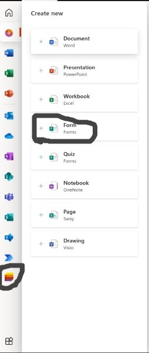
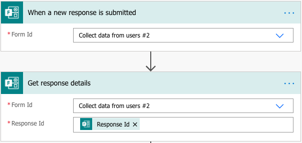
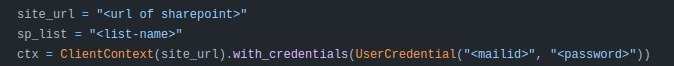
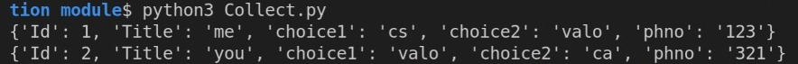

# Collector Module
This module handles the collection of data from the form and providing it to other modules

# Setup
Create a MS Form and a Sharepoint List with enough columns as the form's questions by logging into [office](https://www.office.com/) using organisation mail id 

# Flow Creation
1. Log into  [powerapps](https://www.office.com/) and navigate to My Flows , Now click on Start from Automated flow (from blank) with a trigger _When a new response is submitted_  _(Microsoft Forms)_.

2. Select your form in the _Form Id_ field (flow will run if new response for this form is submitted). Add the _Get response details (Microsoft Forms)_ action (to collect data from the submitted form).

3. Add _Create item (SharePoint)_ action, to create the new item for the submitted response in the list you prepared.

4. Save the flow and test it.

# Collecting responses from sharepoint

1. Log into sharepoint and using your organisation's mail id and copy the url and paste in the site_url field in the python code 
2. Give the list name in the sp_list field in the python code
3. Now give your mail id and password in the UserCredential field
4. Now run the python code after `pip install -r requirements.txt`
5. This will give the output as a list of dictionaries
# Sample Input & Output

# Todo List
 - [ ] Markdown Doc
 - [ ] Implementing env based hiding for username and password

# Further Reading and References
-https://www.youtube.com/watch?v=Z162zqSxz4c&ab_channel=LernenTech

-https://techwizard.cloud/2020/09/30/get-list-items-sharepoint-online-using-python/
